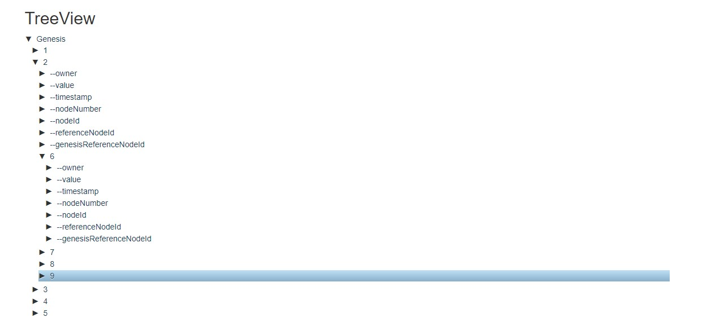
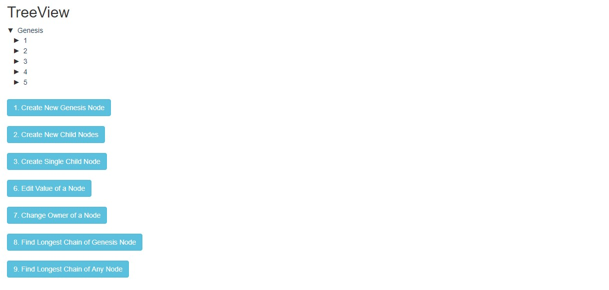
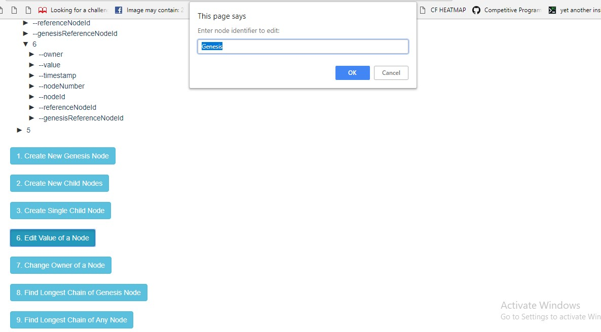

Posist Project

1. Functionalities number 1,2,3,6,7,8,9 has been implemented
2. External Libraries used:
    - Bootstrap for ui
    - Jquery + jQTree (Opensource: https://mbraak.github.io/jqTree/) - This is to easily create an ui for the tree that can be accessed by user in an html page

3. Technologies Used: Javascript, HTML/CSS
4. The application opens with an empty genesis node created
5. You can perform all the functionalities mentioned.
6. The input is taken using normal prompt functionalities of browser and data is saved in local javascript object
7. All the properties of the object is stored in the form of child using a prefix of --. This is done in order to follow the convention of jQTree to easily show in gui in browser
8. Example functionality:

    
    
    

9. How to Run:
    - Download/clone the repo
    - Open index.html in browser (chrome preferred) and perform functionalities